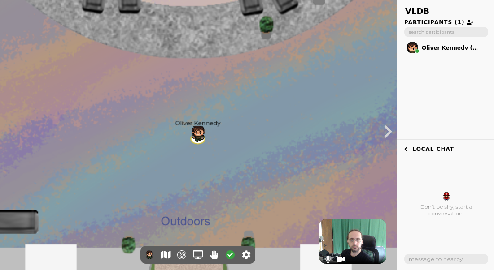
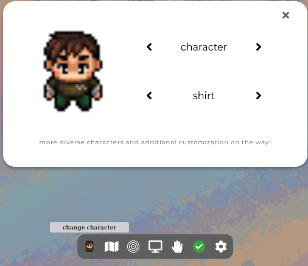

## Using Gather at VLDB

Like SIGMOD, VLDB's Hallway Track will take place on Gather.  
To ensure the best use of people's limited time, VLDB has a designated "Party" session at the end of each 5-hour conference block (Sessions 05Q, 10Q, 15Q, 19Q, 25Q, 30Q, 35Q, 40Q, 45Q, 50Q, 55Q, and 60Q) that will take place on Gather.

#### Gather's Interface
Gather is a virtual environment that lets you freely move around and socialize with colleagues.
The basic idea is simple: Gather sets up a video chat between you and anyone else close to your character on the screen.
To move your character, use arrow keys, or the 'w' (↑), 'a' (←), 's' (↓), and 'd' (→) keys on your keyboard.

When you first open up gather, you'll see a screen like the one above.
Your avatar will be at the center of the screen, in the middle of a virtual environment.  You'll see a list of participants logged in to gather and a chat window on the right.  Your webcam will be at the lower right and a settings menu will be at the bottom of the screen.
You can customize your avatar's appearance (a variety of gender presentations and skin colors are available) using the character button at the left of the settings menu.

As your character gets closer to other people's characters, their webcam feeds will start appearing at the top of your screen.  You can control the distance at which this happens using the Interaction Distance setting (this is the one that looks like a series of concentric circles).  Clicking on this button will cycle through the setting (more circles = further away).

#### The Space

VLDB's Gather space is divided into four zones.  The Main Conference Area (where you start), The Bar (Head north/up from the main area), Outside (Head south/down from the main area), and Social Space (accessible via "stairs" at the center of the main area).  If you're looking to meet up with someone, let them know where you are!

If you need people to meet up in a precise location, there are four designated discussion areas in the Social Space: A (Light Green-Northeast), B (Light Red-Northwest), C (Light Green-Southwest), and D (Light Red-Southeast)

Have fun.